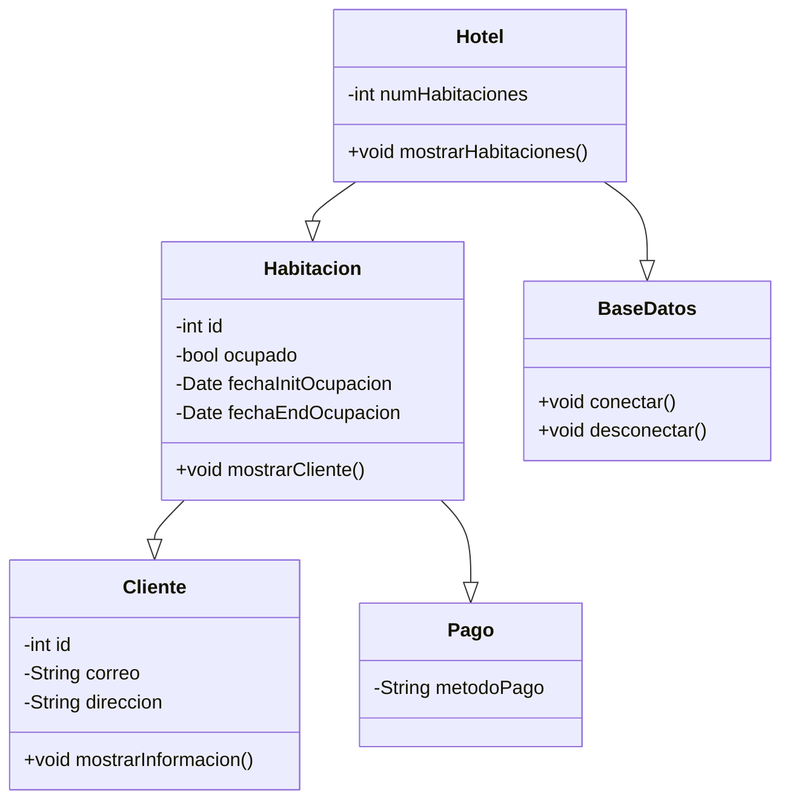

# *Siste Turismo*

<!-- fis_2024_g1 -->

## `Tabla de Contenidos`
- ### [Descripcion](#descripcion "Ir a Descripcion")
- ### [Caracteristicas](#caracteristicas "Ir a Caracteristicas")
- ### [Tecnologias](#tecnologias "Ir a Tecnologias")
- ### [Diagrama Casos de Uso](#diagrama-de-casos-de-uso "Ir a Diagrama Casos de Uso")
- ### [Diagrama de Clases](#diagrama-de-clases "Ir a Diagrama de Clases")
- ### [Instalacion y Uso](#instalacion-y-uso "Ir a Instalacion y Uso")
- ### [Especificacion de Funcionalidades](#especificacion-de-funcionalidades "Ir a Especificacion de Funcionalidades")

## Descripcion
El Sistema de Reservas de Hotel es una aplicación que permite gestionar las reservas de habitaciones en un hotel.  
La aplicación facilita el registro de habitaciones, clientes y reservas, así como la consulta de la disponibilidad de habitaciones.  
Además, ofrece reportes de ocupación y estadísticas del hotel.  
[Volver](#tabla-de-contenidos "Regresar a tabla de contenidos")

## Caracteristicas
- **Registro de habitaciones**: Permite agregar, modificar y eliminar habitaciones en el sistema.
- **Registro de clientes**: Permite agregar, modificar y eliminar información de los clientes.
- **Gestión de reservas**: Permite crear, modificar y cancelar reservas de habitaciones.
- **Disponibilidad de habitaciones**: Consulta la disponibilidad de habitaciones en tiempo real.
- **Reportes de ocupación**: Genera reportes sobre la ocupación de habitaciones.
- **Estadísticas**: Proporciona estadísticas sobre las reservas y la ocupación del hotel.  
[Volver](#tabla-de-contenidos "Regresar a tabla de contenidos")

## Tecnologias
- **Java Swing**: Utilizado para la interfaz gráfica de usuario (GUI).
- **MySQL o PostgreSQL**: Utilizado para la persistencia de datos.  
[Volver](#tabla-de-contenidos "Regresar a tabla de contenidos")

## Diagrama de Casos de Uso
  
[Volver](#tabla-de-contenidos "Regresar a tabla de contenidos")

## Diagrama de Clases

[Volver](#tabla-de-contenidos "Regresar a tabla de contenidos")

## Instalacion y Uso
1. Clona el repositorio: `git clone` [Repositorio](https://github.com/puj-course/fis_2024_g1.git)  
[Volver](#tabla-de-contenidos "Regresar a tabla de contenidos")

## `Lean Canvas`  
### ***Link:*** [Canvas](https://www.canva.com/design/DAGL5-BW-tM/t6wcoT0ZNaTMHwAL7HTbfA/edit?utm_content=DAGL5-BW-tM&utm_campaign=designshare&utm_medium=link2&utm_source=sharebutton) 

## Especificacion de funcionalidades

### Usuario
* Reserva(precio, fecha, check in, check out, etc) "Falta especificar mas"
* Busqueda de hoteles por ciudad/ubicacion
* Disponibilidad de ocupacion en hoteles
* Caracteristicas de habitaciones
* Servicios por GUI
* (Conexion con base de datos)
* Proveer diferentes metodos de pago
* Proveer un espacio para retroalimentacion del hotel y sus habitaciones por parte del usuario

### Hotel
* Informe de estadisticas (habitaciones mas usadas, comentario postivos/negativos)  
* Control de Mantenimiento
* Ver el espacio de retroalimentacion en cuanto al servicio brindado por parte del hotel

[Volver](#tabla-de-contenidos "Regresar a tabla de contenidos")
