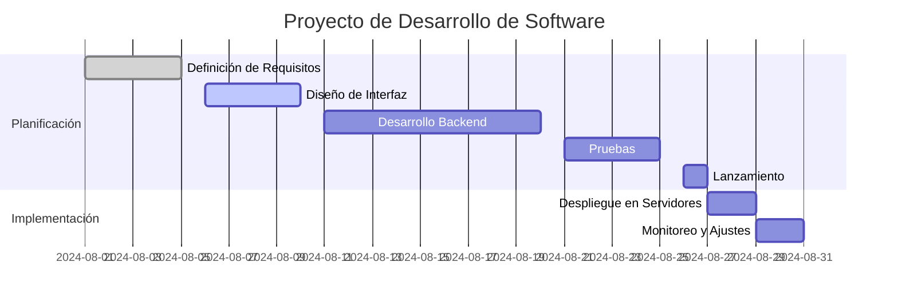

# *Siste Turismo*

<!-- fis_2024_g1 -->

## `Tabla de Contenidos`
- ### [Descripcion](#descripcion "Ir a Descripcion")
- ### [Caracteristicas](#caracteristicas "Ir a Caracteristicas")
- ### [Tecnologias](#tecnologias "Ir a Tecnologias")
- ### [Diagramas del Sistema](#diagrama-de-casos-de-uso "Ir a Diagrama Casos de Uso")
- ### [Instalacion/Uso](#instalacion-y-uso "Ir a Instalacion y Uso")
- ### [Especificacion Funcionalidades](#especificacion-de-funcionalidades "Ir a Especificacion de Funcionalidades")

## Descripcion
El Sistema de Reservas de Hotel es una aplicación que permite gestionar las reservas de habitaciones en un hotel.  
La aplicación facilita el registro de habitaciones, clientes y reservas, así como la consulta de la disponibilidad de habitaciones.  
Además, ofrece reportes de ocupación y estadísticas del hotel.
<br><br>
[Volver](#tabla-de-contenidos "Regresar a tabla de contenidos")

## Caracteristicas
- **Registro de habitaciones**: Permite agregar, modificar y eliminar habitaciones en el sistema.
- **Registro de clientes**: Permite agregar, modificar y eliminar información de los clientes.
- **Gestión de reservas**: Permite crear, modificar y cancelar reservas de habitaciones.
- **Disponibilidad de habitaciones**: Consulta la disponibilidad de habitaciones en tiempo real.
- **Reportes de ocupación**: Genera reportes sobre la ocupación de habitaciones.
- **Estadísticas**: Proporciona estadísticas sobre las reservas y la ocupación del hotel.
<br><br>
[Volver](#tabla-de-contenidos "Regresar a tabla de contenidos")

## Tecnologias
- **Java Swing**: Utilizado para la interfaz gráfica de usuario (GUI).
- **MySQL o PostgreSQL**: Utilizado para la persistencia de datos.
<br><br>
[Volver](#tabla-de-contenidos "Regresar a tabla de contenidos")

## Diagrama de Casos de Uso

<br><br>
[Volver](#tabla-de-contenidos "Regresar a tabla de contenidos")

## Diagrama de Clases

<br><br>

## Diagrama de Despliegue

<br><br>

## Diagrama de Componentes

<br><br>

## Diagrama de Arquitectura MVC

<br><br>


## Diagrama de Base de datos
.jfif?raw=true)
<br><br>

<br><br>
[Volver](#tabla-de-contenidos "Regresar a tabla de contenidos")

## Ejemplo diagrama de Gantt



### Explicación de partes del diagrama de Gantt de ejemplo

- **title**: Título del diagrama, que en este caso es "Proyecto de Desarrollo de Software".
- **dateFormat**: Formato de la fecha utilizado en el diagrama (año-mes-día).
- **section**: Define una nueva sección en el diagrama.
- **Tareas**: Cada tarea se define con un nombre seguido de tres elementos:
  - **Estado de la tarea** (opcional):
    - `done` para tareas completadas.
    - `active` para tareas en progreso.
    - `crit`, `milestone` para marcar hitos importantes.
  - **ID** de la tarea.
  - **Fecha de inicio y fin** de la tarea.
  - También se puede definir la duración de la tarea en días.

## Instalacion y Uso
*Debes tener el programa `git` disponible desde tu terminal de comandos, o correr `Git Bash`*  
1. Posicionate en la ruta del directorio donde quieres copiar el repositorio
2. Clona el repositorio con el comando git clone y el link del proyecto (puedes copiar el siguiente comando):
```sh
 git clone https://github.com/puj-course/fis_2024_g1.git
```
3. Ingresa al repositorio con cd:
```sh
 cd fis_2024_g1
```
4. Da permisos al archivo `deploy.sh` y ejecutalo.
Los siguientes comandos estan escritos para la linea de comandos en `bash` para un sistema operativo `Linux`. Si se requiere ejecutar en `Windows`, adelante se muestran posibles formas de hacerlo.  
 * *Linux:*
 ```sh
  chmod +x ./scripts/deploy.sh;  ./scripts/deploy.sh
 ```
 * *Windows:*  
   * De manera inicial, se pueden utilizar los comandos de Linux mencionados, ejecutandolos en `Git Bash`
   * La segunda manera es instalando Windows *Subsystem for Linux* `WSL`
     <br><br>
     A. *Instalar:* Abre PowerShell como `administrador` y ejecuta
       ```sh
        wsl --install -d Ubuntu
       ```
     B. *Ejecuta el comando:* Ejecuta el comando para bash mostrado anteriormente
     <br><br>
   * La tercera es usar bash como programa para ejecutar el script
     ```sh
      bash scripts/deploy.sh
     ```  
 <br><br>
**Imagen de ejemplo:** En la siguiente imagen se muestra el proceso de despliegue y algunas salidas por pantalla si se ingresar determinadas opciones.

No se muestra el procedimiento de `clonacion` del repositorio.  
<br>

<br><br>
[Volver](#tabla-de-contenidos "Regresar a tabla de contenidos")

## `Lean Canvas`  
### ***Link:*** [Canvas](https://www.canva.com/design/DAGL5-BW-tM/t6wcoT0ZNaTMHwAL7HTbfA/edit?utm_content=DAGL5-BW-tM&utm_campaign=designshare&utm_medium=link2&utm_source=sharebutton) 

## Especificacion de funcionalidades

### Usuario
* Reserva(precio, fecha, check in, check out, etc) "Falta especificar mas"
* Busqueda de hoteles por ciudad/ubicacion
* Disponibilidad de ocupacion en hoteles
* Caracteristicas de habitaciones
* Servicios por GUI
* (Conexion con base de datos)
* Proveer diferentes metodos de pago
* Proveer un espacio para retroalimentacion del hotel y sus habitaciones por parte del usuario  

### Hotel
* Informe de estadisticas (habitaciones mas usadas, comentario postivos/negativos)  
* Control de Mantenimiento
* Ver el espacio de retroalimentacion en cuanto al servicio brindado por parte del hotel  

[Volver](#tabla-de-contenidos "Regresar a tabla de contenidos")
